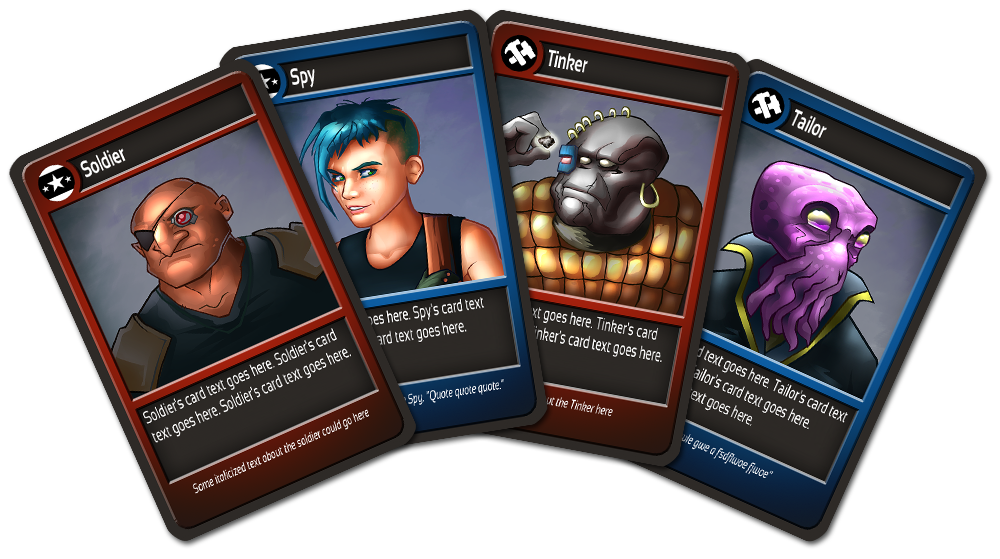
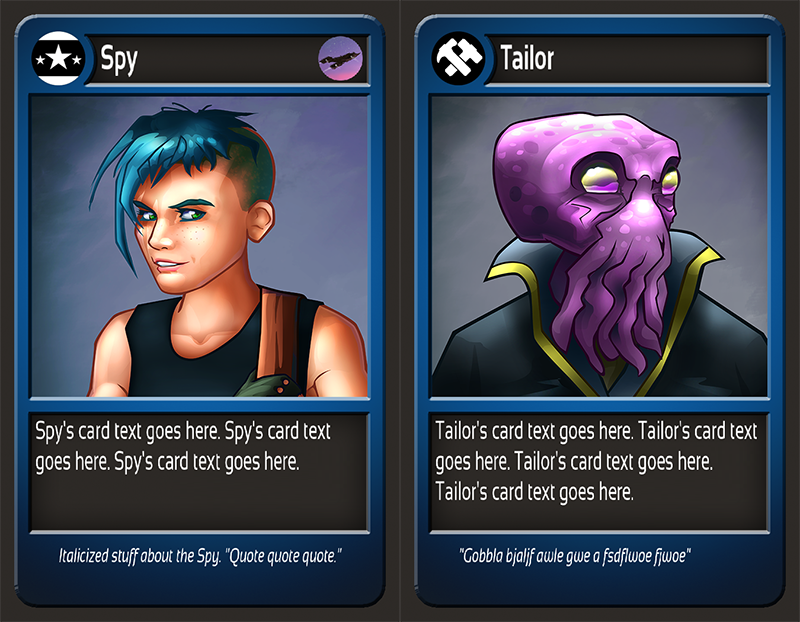

CardCreator
===========

A Processing script to automate playing card creation

The Problem
===========

Making changes to a lot of cards can be insanely time-consuming if you are manually editing and saving each card separately. This program is an attempt to make this easier by defining a customizable card template, so that you can regenerate all cards instantly whenever you change the layout, add or remove elements from your cards, or edit your art files and game text.

Setup
=====

To see an example:

1. Download and install Processing [here](http://www.processing.org/)
2. Clone the CardCreator folder to your local machine
3. Open CardCreator.pde in the Processing IDE
4. Hit Play
5. Four example card files should appear in your CardCreator directory

How it Works
============

CardCreator builds each card file by layering text and image elements according to two files, a template and a content sheet.

Template.csv lists all elements (images and text) to include in every card, including the x & y position, width, and height of each element in pixels.

Content.csv lists each card in a separate row. These rows stores the unique text or images to use for the elements shown in the header, which are defined in Template.csv. For images, content.csv gives the image filename. For text elements, it gives the card text to display.

When CardCreator.pde runs, it builds each card by looking up its row in contents.csv. There, it finds the text or image to use for each element defined in the template, and refers to template.csv to place it. The first elements listed in template.csv are placed first, so they will be covered by any elements listed further down.

How to Use It
=============

Say I want to add a Pilot icon to certain cards to show that those characters can fly spaceships.

1. First, I create the pilot icon and save this in the data folder.  For this example, I'm calling it "pilot.png"
2. Now I need to say where this icon goes, so I open template.csv. I create a new row, type an element name (I'm calling it 'ImgSkill') and define some x and y coordinates, along with the width(w) and height(h) to display the image at in pixels.
  
  - Important: For image elements, the element value must start with 'Img'. For text elements, it must start with 'Text'.
  - Also Important: Currently, you must define an x, y, w, and h value for each element. For text, you also need to choose a size and font. hSquish, the percentage to squish the text by horizontally, is optional.
3. Now I want to define what characters get to be pilots so I open content.csv. I create a new column and place the same Element name I created in the templates.csv file, 'ImgSkill'. For each card I want to make a pilot, I type the filename of the pilot image. By leaving the others blank, they won't get the pilot icon.
  
4. I save template.csv and content.csv.
  - Make sure to save these as .csv's if editing in Excel. Ignore the warning to save as xlsx.
5. Now I open CardCreator.pde and hit the play button again. My updated cards should appear in the CardCreator folder. Since I said that Spy gets the pilot.png icon for her ImgSkill, she now has that icon. Tailor doesn't.
  
